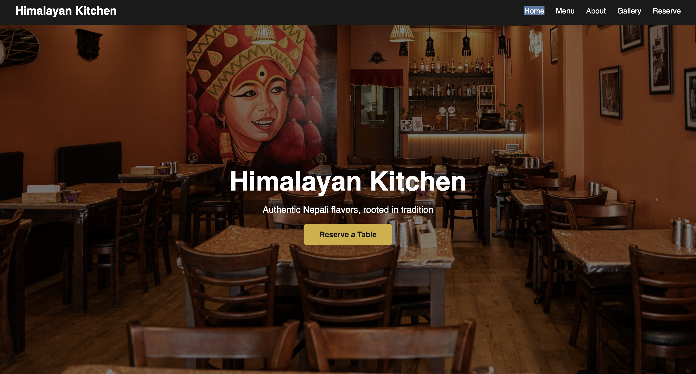
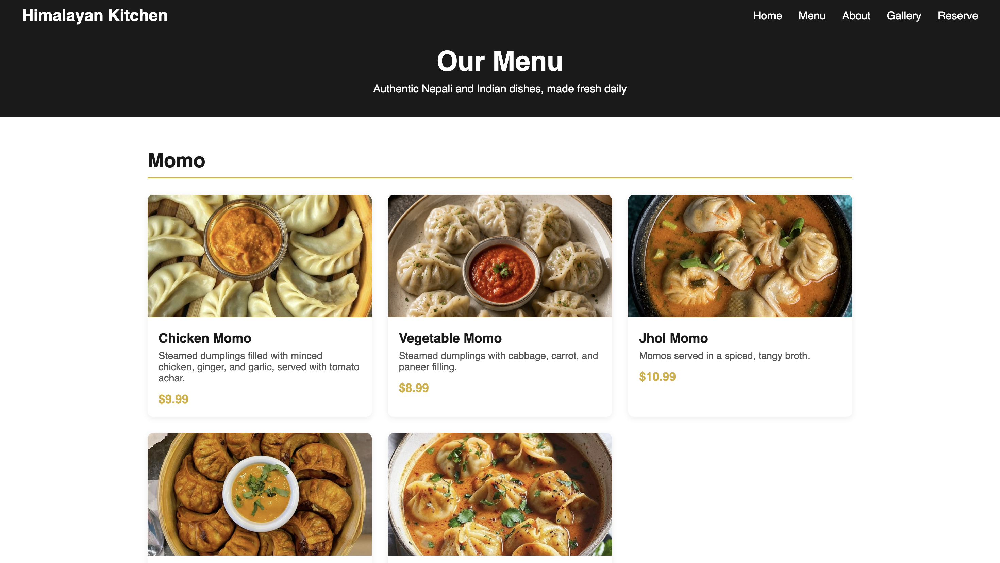
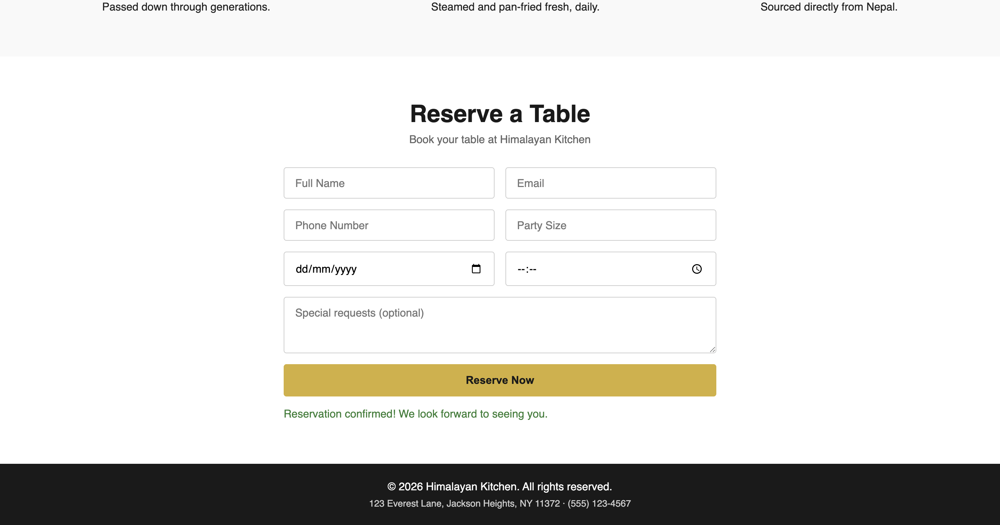
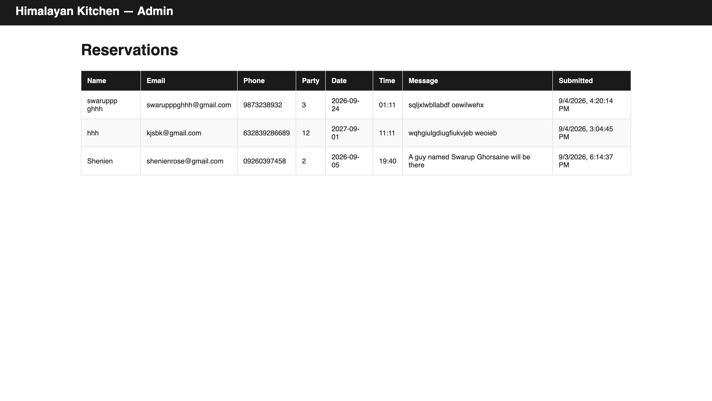

# restraunt_website
# Himalayan Kitchen — Restaurant Website

A full-stack restaurant website built as Project 1 of a 3-project freelance portfolio (Restaurant → Hotel → E-commerce). This isn't a static template — it's a working system with a real Express backend, a MongoDB database, and a genuine reservation pipeline that captures and stores customer data.

**Live site:** [restrauntwebsite-kohl.vercel.app](https://restrauntwebsite-kohl.vercel.app)

## Features

- **Dynamic menu** — 30 dishes across 6 categories (Momos, Nepali Main Courses, Indian Main Courses, Appetizers, Breads & Sides, Desserts), stored in MongoDB and fetched live via a REST API — not hardcoded HTML
- **Real reservation system** — a booking form with full server-side validation (required fields, email format, valid future date, party size limits). Every submission is saved to a live database, with real success/error feedback shown to the user based on what actually happened
- **Admin dashboard** — a dedicated view that lists every reservation ever submitted, pulled live from the database, proving the data pipeline actually works end-to-end
- **Photo gallery** — image grid with a custom-built lightbox (click to enlarge, click outside or × to close)
- **Fully responsive** — tested across mobile, tablet, and desktop breakpoints
- **Scroll animations** — content fades in as the user scrolls, using the Intersection Observer API

## Tech Stack

- **Frontend:** HTML5, CSS3 (Grid & Flexbox), vanilla JavaScript
- **Backend:** Node.js, Express
- **Database:** MongoDB Atlas (cloud-hosted)
- **Deployment:** Vercel (serverless functions), connected to GitHub for auto-deploy on push
- **Environment management:** dotenv, with secrets kept out of version control via `.gitignore`

## Architecture

The site runs two parallel Express setups: `server.js` for local development, and `api/index.js` as the serverless function Vercel actually runs in production. Both share the same routes and MongoDB connection logic, ensuring local and live behavior stay in sync.

### API Routes

| Method | Route | Description |
|--------|-------|-------------|
| GET | `/api/menu` | Returns all menu items from MongoDB |
| POST | `/api/reservations` | Validates and saves a new reservation |
| GET | `/api/reservations` | Returns all reservations, newest first |

## Screenshots

**Homepage**


**Menu page**


**Reservation form — success state**


**Admin dashboard — real captured reservation data**


## What I'd Add With More Time

- Authentication in front of the admin dashboard (currently accessible by direct URL only — fine for a portfolio demo, not production-ready as-is)
- Email confirmation on reservation submission
- Ability for customers to view/cancel their own reservation
- Image upload/management instead of manually editing seed data

## Running Locally

```bash
git clone https://github.com/ghorsaineswarup/restraunt_website.git
cd restraunt_website
npm install
```

Create a `.env` file in the project root: